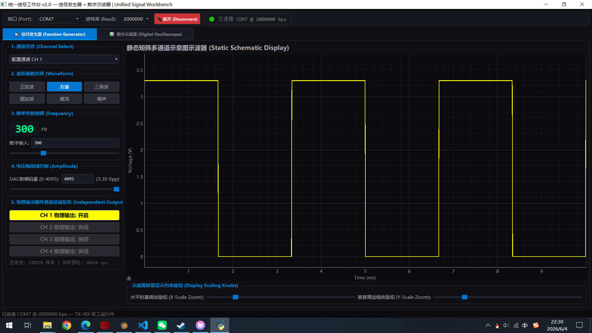
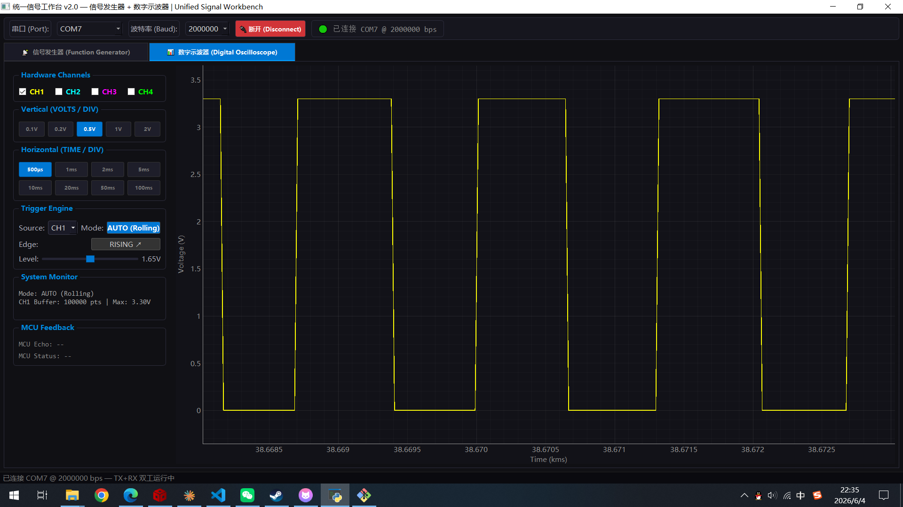
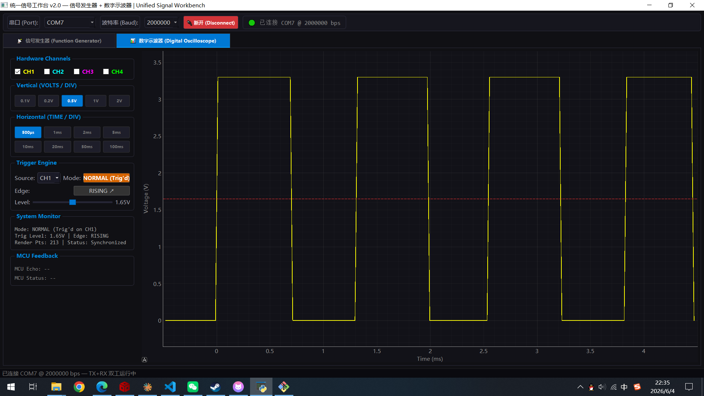

# MSPM0G3507 "地猛星" 函数发生器 + 示波器闭环系统

基于 TI MSPM0G3507 (Cortex-M0+, 32MHz) 的全双工流式信号发生与采集一体化项目。PC 端通过 2Mbps 串口向 MCU 推送 DAC 波形数据，MCU 同步采集 ADC 电压并回传 PC 渲染，形成**发送→DAC 输出→ADC 采集→回传显示**的完整闭环。

---

## 项目结构

```
function_maker_and_oscilloscope_project/
├── empty.syscfg                     # SysConfig 外设配置 (DAC/ADC/UART/TIMER/DMA)
├── empty.c                          # MCU 固件主程序
├── Debug/
│   ├── ti_msp_dl_config.h           # SysConfig 生成的驱动配置头文件
│   └── ti_msp_dl_config.c           # SysConfig 生成的驱动初始化代码
│
├── merged_workbench.py              # 【推荐】统一工作台 (函数发生器 + 示波器双标签)
├── function_generator_mcu_control.py # 独立函数发生器上位机 (v3.0 二进制流式)
├── uart_test.py                     # 串口回环压测脚本 (发送+验证)
├── function_generator.py            # 原 v7.1 函数发生器 (多通道)
├── oscilloscope.py                  # 原 v6.8 数字示波器 (多通道)
│
└── README.md                        # 本文件
```

---

## 功能特性

### MCU 固件 (empty.c)

| 功能 | 实现方式 |
|------|---------|
| DAC 波形播放 | TIMG0 100kHz 中断驱动，从环形缓冲区消费采样点 → `DL_DAC12_output12()` |
| ADC 电压采集 | TIMG0 50kHz (2 分频) 采集，推入环形缓冲区 |
| 串口接收 | UART0 2Mbps 中断接收，11 字节状态机解析 + 校验和验证 |
| 自动转发 | 每收到一帧合法 DAC 数据，立即回传确认 |
| ADC 数据上传 | 主循环批量打包 11 字节紧凑帧，通过 UART TX 发送 |
| 状态上报 | 每秒输出一行调试信息 (发送帧数/丢点数/坏帧数) |

### PC 上位机 (merged_workbench.py)

| 标签页 | 功能 |
|--------|------|
| 📡 信号发生器 | 波形选择 (正弦/方波/三角波/锯齿波/直流/噪声)、频率 1-5000Hz、幅值 0-4095、串口流式推送 |
| 📊 数字示波器 | 4 通道实时波形显示、AUTO/NORMAL 触发、时基/电压档位调节、MCU 状态监控 |

---

## 界面截图

### 信号发生器 (Function Generator)



4 通道独立配置，支持正弦波/方波/三角波/锯齿波/直流/噪声，频率 1–1000 Hz，幅值 0–4095 (0–3.3V)。右侧为静态波形预览，支持水平/垂直缩放。

### 数字示波器 — AUTO 滚动模式



AUTO (Rolling) 模式下，4 通道波形连续向右滚动，自动追踪最新数据。支持 VOLTS/DIV 和 TIME/DIV 独立调节。底部显示 MCU 实时回传的 DAC 值和运行状态。

### 数字示波器 — NORMAL 触发模式



NORMAL (Trig'd) 模式下，波形在触发点冻结。支持上升沿/下降沿触发，触发电平可调 (0–3.3V)。触发源可选 CH1–CH4，多通道波形在触发点精确对齐。

---

## 硬件连接

### 引脚分配

| 外设 | 引脚 | 功能 |
|------|------|------|
| DAC12 | **PA15** | 模拟电压输出 (0–3.3V, 12-bit) |
| ADC12_0 | **PA27** | 模拟电压采集 (0–3.3V, 12-bit) |
| UART0 TX | **PA10** | 串口发送 (MCU → PC) |
| UART0 RX | **PA11** | 串口接收 (PC → MCU) |

### 闭环测试接线

```
PA15 (DAC 输出) ──── 跳线 ──── PA27 (ADC 输入)
```

### 串口连接

```
USB-TTL 适配器 TX  ──── PA11 (MCU RX)
USB-TTL 适配器 RX  ──── PA10 (MCU TX)
USB-TTL 适配器 GND ──── MCU GND
```

---

## 通信协议

### 紧凑帧格式 (11 字节)

```
Offset: [0]   [1]   [2]  [3]  [4]  [5]  [6]  [7]  [8]  [9]  [10]
Value:  0x5A  0xA5  CH   CMD  A1H  A1L  A2H  A2L  A3H  A3L  CKSUM
```

| 字段 | 说明 |
|------|------|
| `0x5A 0xA5` | 帧同步头 |
| `CH` | 通道号 (1-4) |
| `CMD` | `0x01`=标准帧, `0x02`=紧凑帧(3样本), `0x03`=回传帧 |
| `A1H A1L` | 第 1 个 12-bit 采样点 (大端 uint16, 0–4095) |
| `A2H A2L` | 第 2 个采样点 |
| `A3H A3L` | 第 3 个采样点 |
| `CKSUM` | 前 10 字节累加和的低 8 位 |

### 校验和计算

```
CKSUM = (0x5A + 0xA5 + CH + CMD + A1H + A1L + A2H + A2L + A3H + A3L) & 0xFF
```

### 示例帧

```
发送: 5A A5 01 02 07 FF 0F FF 07 FF 1C
      ↑ DAC 值: 2047, 4095, 2047 (正弦波峰), CK=0x1C
```

### 状态行格式 (每秒一次)

```
A:XXXXXXXX L:XXXXXXXX F:XXXXXXXX D:XXXXXXXX
│           │           │           └─ DAC 丢点计数
│           │           └─ 成功接收帧计数
│           └─ ADC 丢点计数
└─ 已发送 ADC 帧计数
```

---

## 开发环境

### 工具链

| 组件 | 版本 |
|------|------|
| IDE | Code Composer Studio Theia (CCS) 12.x |
| 编译器 | TI ARM Clang 4.0.4.LTS |
| SDK | MSPM0 SDK 2.10.00.04 |
| SysConfig | 1.26.2 |
| 调试器 | SEGGER J-Link |
| Python | 3.10+ |

### Python 依赖

```bash
pip install pyserial pyqt5 pyqtgraph numpy
```

---

## 使用方法

### 1. 编译烧录 MCU 固件

1. 在 CCS Theia 中打开项目文件夹
2. 确认 `empty.syscfg` 外设配置正确
3. `Project → Build Project` (Ctrl+B)
4. `Run → Debug` (F11) 烧录到 MSPM0G3507
5. 按 F8 运行

### 2. 串口回环测试 (uart_test.py)

验证 MCU 基本通信：

```bash
# 修改 uart_test.py 中的 COM_PORT 为实际串口号
py -3.10 uart_test.py
```

预期输出：收到 MCU 的 Ready 消息，发送测试帧后收到回传确认。

### 3. 串口工具手动测试

| 参数 | 值 |
|------|-----|
| 波特率 | **2,000,000** |
| 数据位 | 8 |
| 校验 | None |
| 停止位 | 1 |

发送 hex: `5A A5 01 02 00 00 00 00 00 00 02`，应收到回传帧和 ADC 数据帧。

### 4. 运行统一工作台

```bash
py -3.10 merged_workbench.py
```

1. 选择串口 → 点击连接
2. **信号发生器标签页**: 选择波形、调频率/幅值 → 点击启动
3. **示波器标签页**: 配置串口 → 点击 CONNECT → 观察实时波形

---

## 数据闭环流程

```
┌─────────────────────────────────────────────────────────┐
│  PC (merged_workbench.py)                               │
│  ┌─────────────────┐    ┌──────────────────┐            │
│  │ 信号发生器 Tab    │    │ 示波器 Tab        │            │
│  │ DDS→二进制帧→TX  │    │ RX→解析→pyqtgraph │            │
│  └────────┬────────┘    └────────▲─────────┘            │
└───────────┼──────────────────────┼──────────────────────┘
            │ 11-byte frames       │ 11-byte frames
            ▼                      │
┌───────────────────────────────────┼──────────────────────┐
│  MSPM0G3507 (empty.c)             │                      │
│                                   │                      │
│  UART RX ISR ──→ DAC 环形缓冲 ──→ TIMG0@100kHz ──→ PA15 │
│       │                                           │     │
│       └── 自动转发 ───────────────────────────────┘     │
│                                                 跳线    │
│  UART TX ←── main 循环 ←── ADC 环形缓冲 ←── TIMG0@50kHz │
│                                   ▲                     │
│                               PA27 ←────────────────────┘
└──────────────────────────────────────────────────────────┘
```

---

## 测试结果

### 通信验证

- ✅ 2Mbps UART 全双工通信稳定，零误帧
- ✅ 11 字节紧凑帧状态机校验可靠，自动滤除噪点
- ✅ 自动转发功能确认收发通路正常
- ✅ 每秒状态上报显示运行健康度

### 性能指标

| 指标 | 数值 |
|------|------|
| UART 波特率 | 2,000,000 bps |
| DAC 更新率 | 100,000 sps |
| ADC 采样率 | 50,000 sps |
| 有效载荷率 | ~54,500 sps (2Mbps 带宽上限) |
| 频率精度 | < 0.025 Hz (32-bit DDS) |
| DAC 分辨率 | 12-bit (0–4095) |
| ADC 分辨率 | 12-bit (0–4095) |

### 调试命令速查

```bash
# 串口回环压测
py -3.10 uart_test.py

# 统一工作台
py -3.10 merged_workbench.py

# 独立函数发生器
py -3.10 function_generator_mcu_control.py
```
